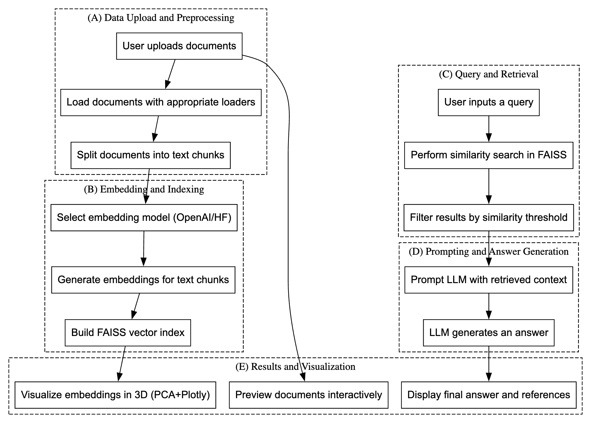

# RAG Document Assistant

A powerful document question-answering system built with Streamlit and LangChain, featuring multiple embedding models and interactive visualizations.



## 🌟 Features

- **Multiple Document Format Support**: PDF, TXT, DOCX, HTML, and MD files
- **Flexible Embedding Options**: OpenAI and HuggingFace embeddings
- **Interactive 3D Visualization**: Document embeddings visualization using PCA
- **Advanced QA Capabilities**: Multiple chain types (stuff, map_reduce, refine, map_rerank)
- **Document Management**: Preview and search functionality
- **Customizable Parameters**: Chunk size, overlap, and similarity thresholds

## 🚀 Getting Started

### Prerequisites

- Python 3.8 or higher
- OpenAI API key
- (Optional) HuggingFace API token

### Installation


1. Install dependencies:
```bash
pip install -r requirements.txt
```

2. Create a `.env` file in the project root:
```
OPENAI_API_KEY=your_openai_api_key
HUGGINGFACEHUB_API_TOKEN=your_huggingface_token  # Optional
```

3. Create a `docs` directory:
```bash
mkdir docs
```

### Running the Application

Start the Streamlit app:
```bash
streamlit run app.py
```

## 💡 Usage Guide

### 1. Import Data
- Upload documents using the file uploader
- Select embedding model (OpenAI or HuggingFace)
- Configure chunk size and overlap
- Build the document index

### 2. Document Exploration
- Preview uploaded documents
- Search within documents
- Visualize document embeddings in 3D

### 3. Question Answering
- Ask questions about your documents
- Adjust retrieval parameters (k, threshold)
- Select QA chain type
- View answers with source references

## 🛠 Technical Stack

### Core Technologies
- **Frontend**: Streamlit
- **Backend**: Python
- **Embeddings**: OpenAI API, HuggingFace Transformers
- **Vector Store**: FAISS
- **LLM Integration**: LangChain

### Key Libraries
- `streamlit`: Web interface
- `langchain`: RAG implementation
- `openai`: OpenAI API integration
- `faiss-cpu`: Vector similarity search
- `sentence-transformers`: HuggingFace embeddings
- `plotly`: 3D visualization
- `pandas` & `numpy`: Data processing
- `scikit-learn`: PCA for visualization

## 🔧 Configuration Options

### Embedding Settings
- Model selection: OpenAI or HuggingFace
- Chunk size: 100-5000 characters
- Chunk overlap: 0-500 characters

### QA Parameters
- Number of documents (k): 1-20
- Similarity threshold: 0.0-1.0
- Chain types: stuff, map_reduce, refine, map_rerank

## 📝 Implementation Details

### Document Processing
1. Document loading with format-specific loaders
2. Text chunking with RecursiveCharacterTextSplitter
3. Embedding generation
4. FAISS index creation

### Question Answering Flow
1. Query embedding
2. Similarity search in FAISS
3. Context filtering based on threshold
4. Answer generation using selected chain type

### Visualization
- PCA dimensionality reduction
- Interactive 3D scatter plot
- Color coding by document source

## 🔒 Security Considerations

- API keys stored in `.env` file
- Secure document handling
- Local vector store storage

